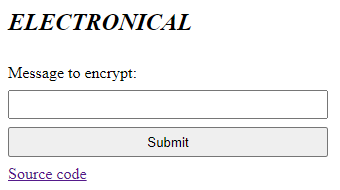

# crypto/Electronical/medium
## Description
I do all my ciphering electronically  
https://electronical.chall.pwnoh.io
## Challenge Author
jm8
## Solution
  
The site allows us to input a message and encrypt it with the "Submit" button. There is also a link to the [source code](site_source_code.py).
Examining the source code, it seems that after we submit our message, it'll go down the ```encrypt``` path.
```python
cipher = AES.new(key, AES.MODE_ECB)

def encrypt(message: str) -> bytes:
    length = math.ceil(len(message) / 16) * 16
    padded = message.encode().ljust(length, b'\0')
    return cipher.encrypt(padded)

@app.get('/encrypt')
def handle_encrypt():
    param = request.args.get('message')

    if not param:
        return abort(400, "Bad")
    if not isinstance(param, str):
        return abort(400, "Bad")

    return encrypt(param + flag).hex()
```
From this part of the code, we can see that our message will be prepended to the flag, padded with ```\0``` to a length that's a multiple of 16, and encrypted. And the output will be a sequence of hexadecimal digits. The encryption method used is AES in ECB mode.  

After researching online about AES ECB, I found this [guide](https://zachgrace.com/posts/attacking-ecb/) that explains how to find the block size, offset, and how to decrypt.  

Following the guide, I inputted messages of consecutive ```a```'s until the output hex increased in length, meaning that there is an extra character that is occupying a new block.
Initially, the hex sequence is 96 characters long, meaning 48 bytes. 
After 9 ```a```'s, the hex sequence became 128 characters long, meaning 64 bytes.  
We can conclude that the block size is ```64 - 48 = 16``` bytes and the offset is ```9 - 1 = 8``` bytes, which tells us that the flag is ```48 - 8 = 40``` bytes long or 40 characters long.  
I also wrote some [code](test_blocks.py) to see how blocks are changing with each ```a``` added.

To successfully decrypt, we need to have a full block of ```a```'s and remove one ```a``` at a time so the last bytes of our known block start to get filled with the prefix characters of the flag. Then we can brute-force by trying all possible characters until we find a match between the encrypted texts.
To get a full block of ```a```'s as our known encrypted block, we can send ``block_size = 16`` bytes of ```a```.
Since the flag is 40 characters long we need to have at least 3 full blocks, or 48 ```a```'s so that we have enough ```a```'s to remove from our message.  

To brute-force the flag, we will start by sending 47 ```a```'s, so that the last byte in our known block is the first character of the flag. We save the hex sequence of that block.  
Then we iterate through all possible characters, appending the character to the end of our message + found_flag_plaintext, and see if the resulting sequence matches the sequence we saved before.  
Once we find a match, we can remove another ```a``` from our message and repeat.  

See [solve script](solve.py) for implementation.
